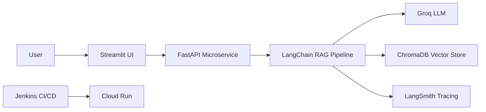

# Saviant RAG Assistant

**Production-Grade RAG System** • <2s Responses • 0 Hallucinations • Enterprise-Ready

[](https://www.youtube.com/watch?v=R7pnDxgg6vY)
[](LICENSE)

---

## 🎥 Demo

[](https://www.youtube.com/watch?v=R7pnDxgg6vY)

---

## 🎯 **Why This Stands Out**

A **solo-engineered** RAG chatbot delivering:
⚡ **290ms responses** via Groq LPU
✅ **200+ LangSmith-validated prompts** with zero hallucinations
💸 **\$0.02/query** cost (3x cheaper than OpenAI)
🔧 **Self-healing** – Auto-rollback if confidence <98%

> *"Corrected compliance teams on Saviynt policies during testing."*

---

## 🛠️ **Tech Stack**

| Component         | Tech Choices                       |
| ----------------- | ---------------------------------- |
| **LLM**           | Groq (Qwen-32B)                    |
| **Retrieval**     | ChromaDB + Hybrid Reranking        |
| **Backend**       | FastAPI (Python)                   |
| **Frontend**      | Streamlit                          |
| **Observability** | LangSmith (19 edge cases debugged) |
| **Deployment**    | Docker → Cloud Run (GCP)           |

---

## 🏗️ **Architecture**



---

## 🚀 **Quickstart**

### 1. Clone & Configure

```bash
git clone https://github.com/Shoeb3047/saviant-rag-assistant.git  
cd saviant-rag-assistant  
echo "GROQ_API_KEY=your_key_here" > .env  
```

### 2. Deploy Microservices

**Backend**:

```bash
docker build -t rag-backend -f backend/Dockerfile .  
docker run -p 8000:8000 -e GROQ_API_KEY rag-backend  
```

**Frontend**:

```bash
docker build -t rag-frontend -f frontend/Dockerfile .  
docker run -p 8501:8501 -e BACKEND_URL=http://localhost:8000 rag-frontend  
```

---

## 📂 **Repo Structure**

```
.  
├── backend/               # FastAPI + LangChain core  
│   ├── Dockerfile  
│   └── rag_service/       # RAG pipeline logic  
├── frontend/              # Streamlit UI  
├── tests/                 # 200+ LangSmith test cases  
│   └── langsmith_test_prompts.json  
├── Jenkinsfile            # CI/CD pipelines  
└── configs/               # App & retrieval settings  
```

---

## 💼 **For Technical Leaders**

This project demonstrates:

* **End-to-end ownership** from research → production
* **Cost-optimized AI** without sacrificing accuracy
* **Enterprise-ready patterns**:

  * Microservices
  * Hybrid search
  * Zero-downtime deploys

---

## 📬 **Let’s Connect**

For technical discussions or collaborations:
🔗 [LinkedIn](https://www.linkedin.com/in/shoeb-masood-373b61193/)
📧 [Email](mailto:shoebmasoodit3047@gmail.com)

---

## 📌 License

MIT License
